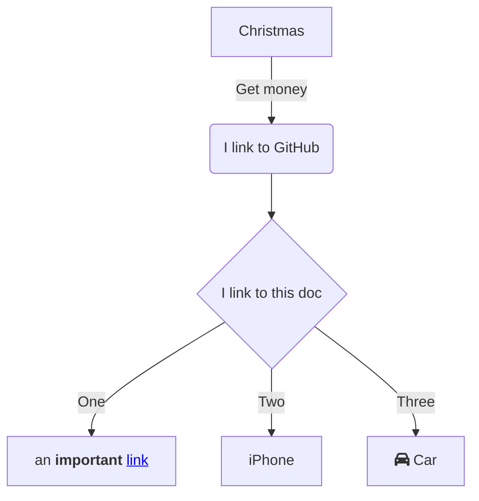

# proto-jasmin-mermaid-docs

Here are some prototype JASMIN mermaid docs. All components are in this single MarkDown file at the moment. The idea is that there are various Mermaid Flowcharts that link to different parts of the docs, and to other flowcharts.

**Note about internal links:**
I haven't worked out how to use internal links within Mermaid `href` elements so I'm using the full URL to this page for now: https://github.com/agstephens/proto-jasmin-mermaid-docs/blob/main/README.md

# Managing a Python Workflow on JASMIN - starting with a Jupyter Notebook

Users will often start their journey with a Python script (`*.py`) or Jupyter Notebook (`*.ipynb`). They will typically do exploratory work using the [JASMIN Notebook Service](https://help.jasmin.ac.uk/docs/interactive-computing/jasmin-notebooks-service/), and then may scale up their workflow by migrating to the Slurm cluster (using the ORCHID partition in the case of GPU/ML work). This flowchart is designed to help you understand the various stages that are involved in setting up, testing, running and scaling a scientific workflow on JASMIN.

[hello](#Here)

sfs
sd
fs
ds

sdf
sdf
sdf

sd
f
sdf

dsf
dsf

f
f
dsf
dsf
dsf
sdf
sfs

## Here

fsdf sdf
sf
ds
f

sd
f
dsf
s
dsf
dsf
sdfsd

## Mermaid

 skdj sdf
 dsf
 dsf
 sf
 
 
 sdf 
 sf
 sf
  sf
  s fs
   fs
    s
    
    
    s fds
    

