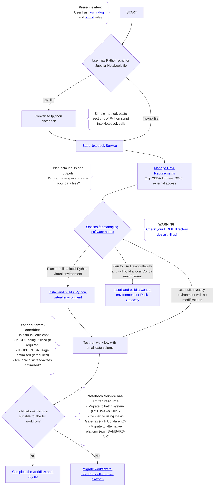
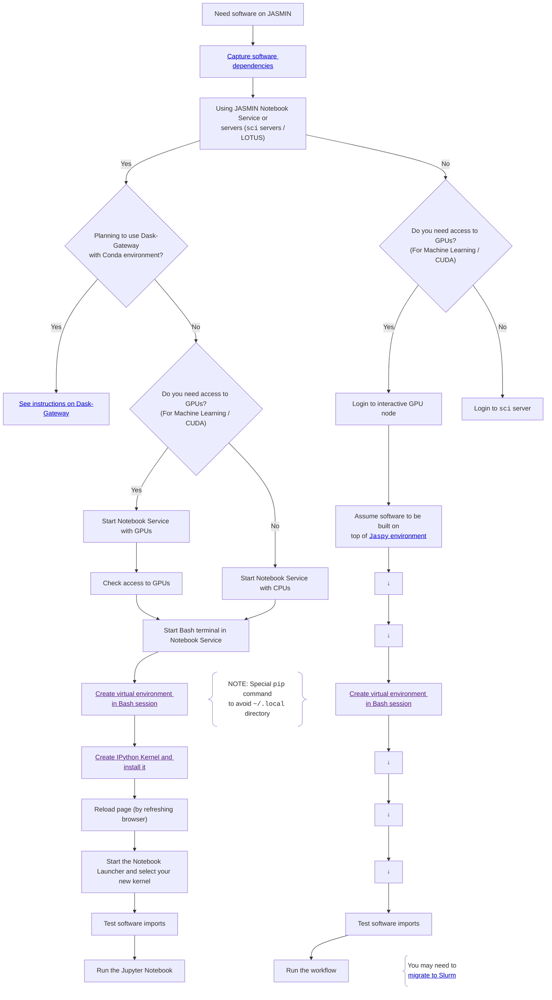
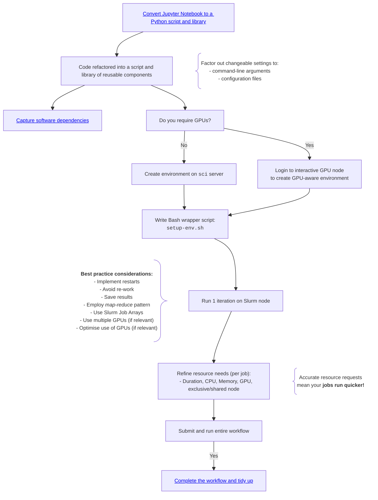

# proto-jasmin-mermaid-docs

Here are some prototype JASMIN mermaid docs. All components are in this single MarkDown file at the moment. The idea is that there are various Mermaid Flowcharts that link to different parts of the docs, and to other flowcharts.


**Note about internal links:**
I haven't worked out how to use internal links within Mermaid `href` elements so I'm using the full URL to this page for now: https://github.com/agstephens/proto-jasmin-mermaid-docs/blob/main/README.md

# Managing a Python Workflow on JASMIN - starting with a Jupyter Notebook

Users will often start their journey with a Python script (`*.py`) or Jupyter Notebook (`*.ipynb`). They will typically do exploratory work using the [JASMIN Notebook Service](https://help.jasmin.ac.uk/docs/interactive-computing/jasmin-notebooks-service/), and then may scale up their workflow by migrating to the Slurm cluster (using the ORCHID partition in the case of GPU/ML work). This flowchart is designed to help you understand the various stages that are involved in setting up, testing, running and scaling a scientific workflow on JASMIN.



---

## Managing Data Access

When working with data on JASMIN you may need to access scientific data from multiple sources, including:
- The CEDA Archive (reading files locally)
- JASMIN Group Workspaces (reading files locally)
- Data held on Object Store or other locations
- Scratch Disk
- External sources

To optimise your workflows, it is often useful to set up _data reader_ functions or classes that receive your data requirements (e.g. experiment, variable, temporal range, spatial selection) and return either a list/iterator of file paths or data objects (such as `xarray Dataset`, `cfpython FieldLists` or `iris Cubes`).

### Setting up data readers

**Internal notes...that we could build on...:**
- use a common approach to various packages
- local (`/badc`) vs remote (`https`) access
- Usability on ISAMBARD AI and CoLab, as well as JASMIN
- Generic approaches to loading/templating
- Applications/mapping to Machine Learning Data Loaders in common packages (`pytorch, tensorflow, JAX`)
- Potential use of CEDA DataPoint
- Delayed (_lazy_) loading of the actual data until it is needed
- Loading of different feature types:
  - 7D data all the way down to 1D data
  - In tools like `xarray` and `cfpython`:
    - this would involve adding in new dimensions and concatenating along them.
    - this would only work if `t, z, y, x` are identical - so might be irrelevant for much of CMIP.

---

## Software Management

Managing software environments on JASMIN can be confusing unless you clearly understand some of the key distinctions. This section tells you what you need to know in order to create and build environments that will work on the various JASMIN systems:
1. JASMIN Notebook Service:
   - CPU-based - standard
   - CPU-based - with Dask-Gateway for parallel scaling
   - GPU-based - for Machine Learning and CUDA-optimised code
2. Scientific Analysis Servers and Batch System (LOTUS):
   - CPU-based - `sci` servers and main LOTUS cluster
   - GPU-based - GPU interactive node and ORCHID cluster - for Machine Learning and CUDA-optimised code



### Python Best Practice

This sections outlines some best practice advice for how you write, structure, test, publish and deploy Python packages. These are based on sound guidelines for code reusability and sharing.

...more here...including:
- Refactoring a Python script/notebook into a script and a library
- Running a Python script with inputs from:
  - The command-line
  - Configuration files
  - Environment variables
- Structuring your code for re-use and sharing
- Managing your software dependencies
  - Using `requirements` files
    - simple...to...advanced
- Using GitHub for tracing, testing, sharing, publication
- Publishing to PyPI

### Managing Software Dependencies

Most scripts and notebooks will import software packages or libraries. In the case of Python, some libraries are provided as part of the [Python Standard Library](https://docs.python.org/library/index.html) (such as `math` and `os`). However, scientific work typically uses many external open-source libraries (such as `pandas` and `numpy`).

In order to make your code reproducible and sharable, we strongly advise that you record your software dependencies using `requirements` files, as discussed below.

#### Managing your dependencies using a "requirements" file

The simplest way to package up your software dependencies is to list them in a `requirements.txt` file, such as:

```bash
$ cat requirements.txt
numpy
pandas
sklearn
```

The environment can then be installed with a single `pip` command:

```bash
$ pip install -r requirements.txt
```
##### Advanced and reusable use of "requirements" files

...more info here about `pip compile` etc...


### Building Virtual Environments

...what python venvs are...how to build them...etc

## Using Dask-Gateway

...overview...

### Building Conda Environments for use with Dask-Gateway

...how to setup a conda env that will work across the Notebook and Sci/Batch estates seamlessly...

---

## Managing Data Workflows on JASMIN

When building a data workflow on 

### Workflow Migration

Many users will develop a workflow in a Jupyter Notebook and scale it up on to the LOTUS cluster. In the case of Machine Learning workflows, they will also require use of the GPU-nodes on LOTUS, known as ORCHID. This flowchart helps you navigate the various stages required to move from a single Notebook file through to a large-scale deployed and completed workflow.



### Workflow Completion

Once you have completed your workflow on JASMIN, there are a number of possible follow-up tasks that you should consider:
- Publish your code to:
  - A GitHub (or other) public/private repository
  - PyPI
- Publish your results to:
  - A scientific journal
  - A blog post
- Publish data data to:
  - The CEDA Archive
  - Another data catalogue/repository
- Publish your Machine Learning model (if relevant) to:
  - HuggingFace
- Deploy your model/algorithm as an application/service:
  - On JASMIN
  - To the Cloud
 
Additionally, we strongly encourage you to _tidy up_ the content that remain on JASMIN, which might include:
- local software environments/packages
- temporary and cache files
- data stored on `scratch` disk or GWSs
- data stored on Object Store or in the Transfer Cache
- Others???

## Managing your HOME directory

Your `$HOME` directory has a quota of 100GB, but users often fill this up. When you home directory is full, you may see strange behaviours on JASMIN that do not immediately indicate the problem is that you have exceeded your quota. Although _data_ is the common cause of exceedence, modern software installations can also be many GBs in size. In particularly, ML packages such as `pytorch` and `tensorflow` can severely bloat a software environment.

### Checking your $HOME directory usage

To check your current `$HOME` directory usage, on a `sci` server, type:

```bash
pdu -sh $HOME
``` 

### What is filling up your $HOME directory?

Here are some common locations within your `$HOME` directory where large files may be found:
- `.local/lib*/python*/site-packages` (NOTE: the `*` represent wild-cards, you may have multiple instances of each)
- `.miniconda`
- `miniconda`
- `.conda`
- `conda`
- large downloads like the `Miniconda` installation file
- other packages that have been installed under `dot` directories: `~/.*`

### Tips for clearing space in your $HOME directory

- Can you move data from your `$HOME` directory to a Group Workspace?
- Can you move large code installations to a [_Small-files_ Group Workspace](https://help.jasmin.ac.uk/docs/short-term-project-storage/faqs-storage/#2-issues-with-small-files)? 
