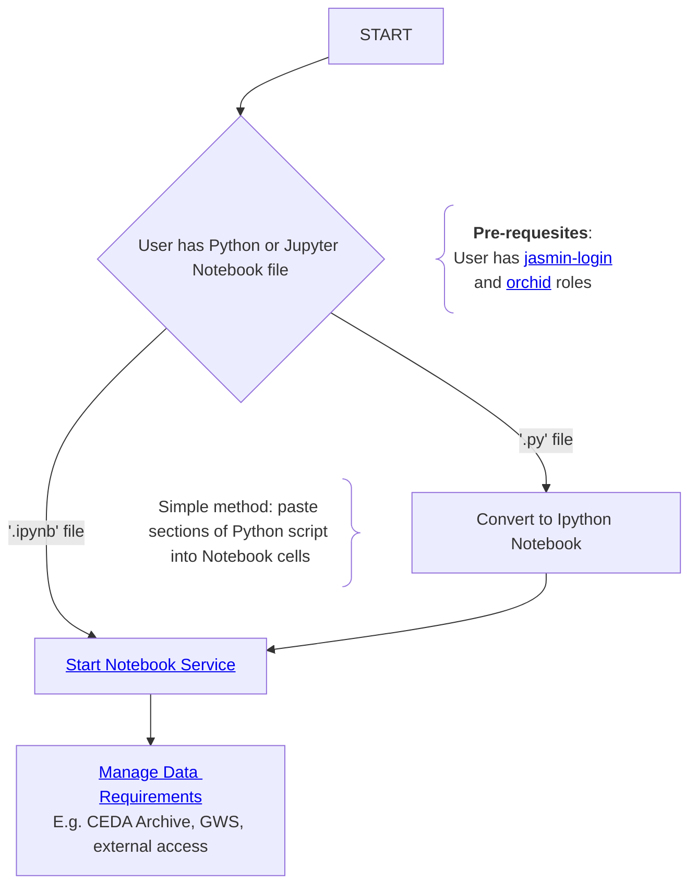

# proto-jasmin-mermaid-docs

Here are some prototype JASMIN mermaid docs. All components are in this single MarkDown file at the moment. The idea is that there are various Mermaid Flowcharts that link to different parts of the docs, and to other flowcharts.

**Note about internal links:**
I haven't worked out how to use internal links within Mermaid `href` elements so I'm using the full URL to this page for now: https://github.com/agstephens/proto-jasmin-mermaid-docs/blob/main/README.md

# Managing a Python Workflow on JASMIN - starting with a Jupyter Notebook

Users will often start their journey with a Python script (`*.py`) or Jupyter Notebook (`*.ipynb`). They will typically do exploratory work using the [JASMIN Notebook Service](https://help.jasmin.ac.uk/docs/interactive-computing/jasmin-notebooks-service/), and then may scale up their workflow by migrating to the Slurm cluster (using the ORCHID partition in the case of GPU/ML work). This flowchart is designed to help you understand the various stages that are involved in setting up, testing, running and scaling a scientific workflow on JASMIN.




## Managing Data Access

When working with data on JASMIN you may need to access scientific data from multiple sources, including:
- The CEDA Archive (reading files locally)
- JASMIN Group Workspaces (reading files locally)
- Data held on Object Store or other locations
- Scratch Disk
- External sources

To optimise your workflows, it is often useful to set up _data reader_ functions or classes that receive your data requirements (e.g. experiment, variable, temporal range, spatial selection) and return either a list/iterator of file paths or data objects (such as `xarray Dataset`, `cfpython FieldLists` or `iris Cubes`).

### Setting up data readers

**Internal notes...that we could build on...:**
- use a common approach to various packages
- local (`/badc`) vs remote (`https`) access
- Usability on ISAMBARD AI and CoLab, as well as JASMIN
- Generic approaches to loading/templating
- Applications/mapping to Machine Learning Data Loaders in common packages (`pytorch, tensorflow, JAX`)
- Potential use of CEDA DataPoint
- Delayed (_lazy_) loading of the actual data until it is needed
- Loading of different feature types:
  - 7D data all the way down to 1D data
  - In tools like `xarray` and `cfpython`:
    - this would involve adding in new dimensions and concatenating along them.
    - this would only work if `t, z, y, x` are identical - so might be irrelevant for much of CMIP.

## Managing your $HOME directory on JASMIN

Your `$HOME` directory has a quota of 100GB, but users often fill this up. When you home directory is full, you may see strange behaviours on JASMIN that do not immediately indicate the problem is that you have exceeded your quota. Although _data_ is the common cause of exceedence, modern software installations can also be many GBs in size. In particularly, ML packages such as `pytorch` and `tensorflow` can severely bloat a software environment.

### Checking your $HOME directory usage

To check your current `$HOME` directory usage, on a `sci` server, type:

```bash
pdu -sh $HOME
``` 

### What is filling up your $HOME directory?

Here are some common locations within your `$HOME` directory where large files may be found:
- `.local/lib*/python*/site-packages` (NOTE: the `*` represent wild-cards, you may have multiple instances of each)
- `.miniconda`
- `miniconda`
- `.conda`
- `conda`
- large downloads like the `Miniconda` installation file
- other packages that have been installed under `dot` directories: `~/.*`

### Tips for clearing space in your $HOME directory

- Can you move data from your `$HOME` directory to a Group Workspace?
- Can you move large code installations to a [_Small-files_ Group Workspace](https://help.jasmin.ac.uk/docs/short-term-project-storage/faqs-storage/#2-issues-with-small-files)? 

## Example mermaid diagram


